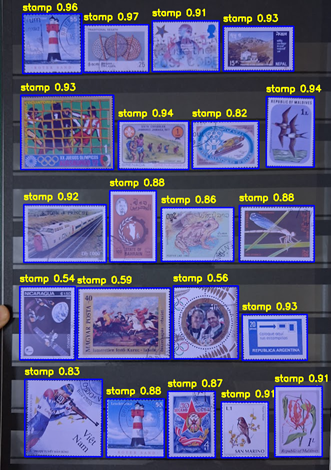

# Philately Tool 📮

A lightweight command-line utility for stamp collectors to digitize, index, and search massive collections. This tool automates the tedious process of cropping individual stamps from full album scans and uses AI to make them searchable via text or image similarity.


 

## 🚀 What It Does

* **Batch Extraction:** Scans a folder of album pages and automatically detects and crops individual stamps into standalone images.
* **Intelligent Indexing:** Creates a searchable vector database using CLIP embeddings.
* **Reverse Image Search:** Identify and locate a stamp in your physical collection by providing a photo.
* **Natural Language Search:** Find stamps using text descriptions (e.g., "red triangular stamp" or "1 cent Washington").
* **Lightweight CLI:** Designed for speed and ease of use on local hardware.

 

## 🛠 Installation & Setup

### 1. Prerequisites

You will need Python 3.9+ and the `sqlite-vec` extension for vector search capabilities.

### 2. Install Dependencies

```bash
sudo apt-get update
sudo apt-get install -y libgl1
```

```bash
pip install ultralytics sentence-transformers opencv-python pillow tqdm rich sqlite-vec rembg onnxruntime pysqlite3-binary
```

### 3. Required Files

The program relies on a trained YOLO model. Ensure your weights are located at:
`runs/detect/train25/weights/best.pt`

On the first run, the script will generate a `philately.json` configuration file. You can modify this to change the database path, search sensitivity, or cropping margins.

### 4. Initialization

Prepare the database environment:


```bash
python philately_tool.py init
```

 

## 📖 Usage

### 📁 Organizing and Indexing Your Collection

The tool is designed to mirror the physical organization of your collection. For the best results, it is highly recommended to run the `index` command **separately for each album**.

#### 1. The Index Command

Running `index` processes every image in a folder, crops the stamps, and creates a searchable entry in the database.

```bash
python philately_tool.py index ./path/to/my_india_2025_album
```

#### 2. How the Mapping Works

Every time you run this command, the tool automatically parses your folder structure to build a relational map in the SQLite database. It tracks three specific data points for every stamp:

* **Album Name:** Taken from your folder name (e.g., *India 2025*).
* **Page Number:** Taken from the original image filename.
* **Segment ID:** The specific stamp number found on that page.

#### 3. Database vs. Local Files

* **`index` (Recommended):** Creates the cropped images in your `/stamps` folder **and** saves the Album  Page  Stamp mapping to the database for searching.
* **`extract`:** Only generates the cropped images (does not add anything to database). Use this if you want to organize the files yourself and do not need the AI search functionality.

> **Pro Tip:** By indexing one album at a time, you ensure your search results can tell you exactly which physical book to pull off your shelf to find a specific stamp.

 
 

### Search by Image

Find a stamp's location using a reference photo:

```bash
python philately_tool.py search_image my_stamp_photo.jpg --top 5
```

### Search by Text

Search your collection using natural language:

```bash
python philately_tool.py search_text "purple 1890 postage"
```


When you perform a text or image search, the tool returns a ranked list of matches based on visual similarity:

| Album | Original Page | Extracted Stamp (Saved File) | Similarity Score* |
| --- | --- | --- | --- |
| **India_2025** | page_01.jpg | India_2025_page_01_seg8.png | 0.7365 |
| **India_2025** | page_04.png | India_2025_page_04_seg1.png | 0.7475 |
| **Great_Britain** | 1840_scans.png | Great_Britain_1840_scans_seg9.png | 0.7502 |
| **Germany_Collection** | folder_02.jpeg | Germany_folder_02_seg6.png | 0.7592 |
| **Germany_Collection** | folder_02.jpeg | Germany_folder_02_seg0.png | 0.7593 |

 


> **Note on Distance:**
> The **Distance** column represents the cosine distance between your search query and the stamp.
> * A score closer to **0.0** is an exact or near-perfect match.
> * A score closer to **1.0** indicates lower similarity.
> 


It is aslo possible to specify distance during search
```bash
python philately_tool.py search_text "purple 1890 postage" --distance 0.85
```

 

## 🧠 Training the Model

The detection engine (YOLO) was trained using a specific hybrid methodology to handle diverse philatelic layouts:

* **Black Album Pages:** Leveraged **Facebook’s Segment Anything Model (SAM)** to automatically generate high-fidelity masks from personal collections. The high contrast provided by black stock pages allowed for extremely accurate automated segmentation.
* **White Album Pages:** Because white stamps on white pages lack contrast, the model was supplemented with **manually tagged AI-generated album images** to help the AI learn to distinguish paper edges and perforations against light backgrounds.

> [!WARNING]
> The model is a work in progress. It may occasionally miss stamps or include parts of the album page in the crop.

 

## 🧪 Experimental: Background Removal

The tool includes a feature to remove the album page background entirely from the crop using the `--rembg` flag:

```bash
python philately_tool.py index ./path/to/scans --rembg
```

**Note on Stability:**
The background removal feature is currently **highly unstable and experimental**. It uses the `u2netp` model to attempt to isolate the stamp from the page. Results vary wildly depending on the stamp color and page texture. Use this at your own risk, as it may accidentally "eat" the edges of your stamps or fail to process entirely.


 

## ⚠️ Important Maintenance

* **Database Integrity:** The SQLite database tracks the location of images in the `stamps/` folder. **If you manually delete or rename files in the stamps folder, you must manually fix your database.**
* **Hardware:** Vector search and indexing are best performed on a machine with a dedicated GPU, though the tool will run on a standard CPU with a longer processing time.

 

 
## 💾 How to Backup

Because the tool relies on both a physical folder of images and a relational database, a complete backup requires saving two specific components. If these two get "out of sync," your search results will point to files that don't exist.

### 1. The Essential Files

To back up your entire indexed collection, copy the following to your backup drive:

* **`philately.db`**: This SQLite file contains all your metadata, page mappings, and AI search vectors.
* **`stamps/` folder**: This contains every individual cropped stamp image generated by the tool.
* **`philately.json`**: (Optional) This saves your custom settings like margins and model paths.

### 2. Backup Workflow

1. **Stop any active indexing:** Ensure the script is not currently running to avoid database corruption.
2. **Compress for storage:** It is recommended to zip the database and the stamps folder together to keep the versions synchronized.
```bash
zip -r philately_backup_2025.zip philately.db stamps/ philately.json
```


### 3. Restoring Your Collection

To restore your collection on a new machine:

1. Install the [Prerequisites](https://www.google.com/search?q=%23-installation--setup).
2. Place `philately.db` and the `stamps/` folder in the root directory of the tool.
3. Ensure your `best.pt` model file is in the path defined in your `philately.json`.
4. Run a test search: `python philately_tool.py search_text "test"`.

 

### ⚠️ A Note on Data Integrity

The database uses **absolute mapping** based on the filenames.

* **Do not rename** the `stamps/` folder.
* **Do not rename** individual images inside the `stamps/` folder.
If you need to reorganize your files, it is best to run the `init` command and re-index your albums to ensure the database remains accurate.

 

**Would you like me to help you write a small shell script to automate this backup process daily?**

